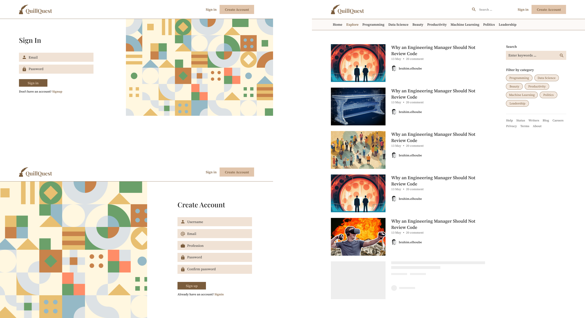
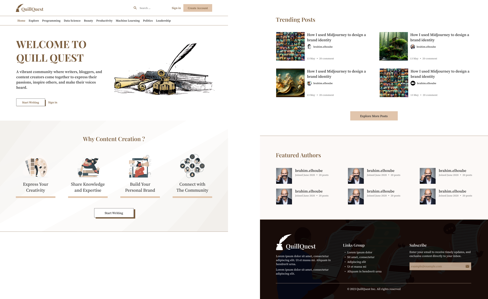
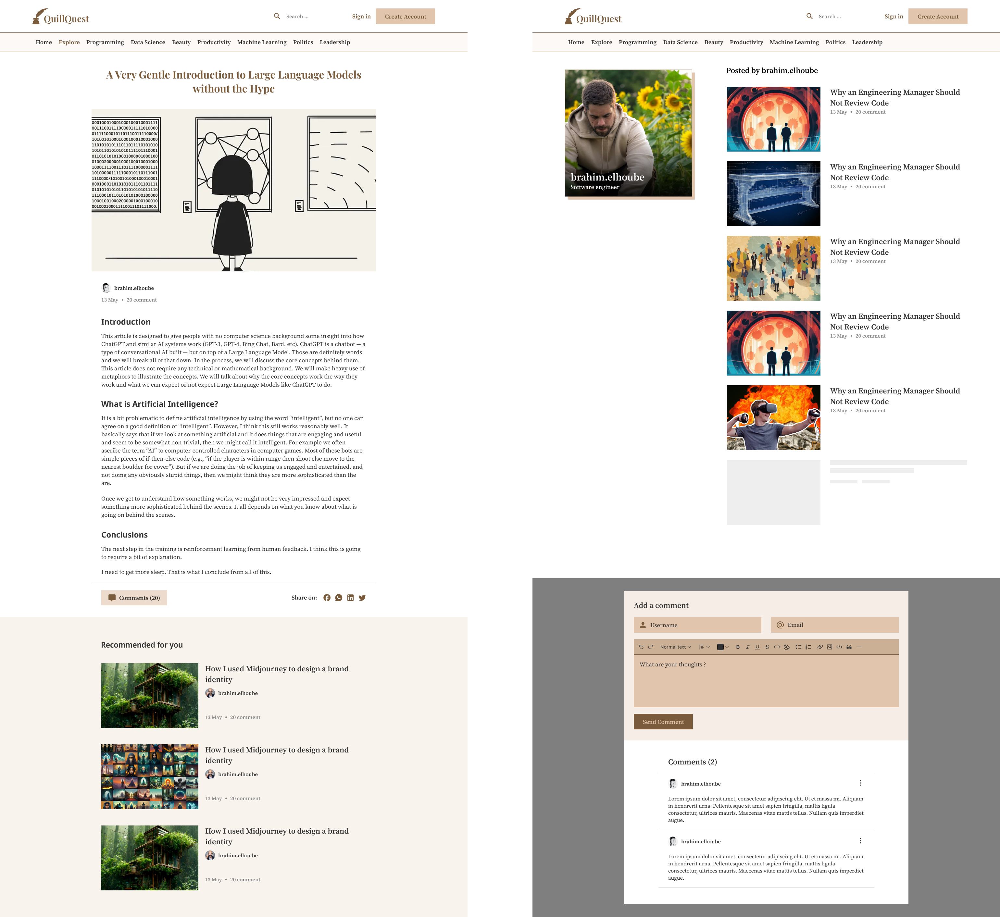

---

Online platform build for writers, bloggers, and content creators to unleash their creativity, share their ideas, and connect with a thriving community of readers.

<br />

## Table of Contents

- [About the Project](#about-the-project)
- [Used Technologies](#used-technologies)
- [How to Use](#how-to-use)
  - [Installation](#installation)
  - [Screenshots](#screenshots)
- [Roadmap](#roadmap)
- [Contact](#contact)

## About the Project


<br />

This project is has been assigned by our esteemed professor [Aziz DAAIF](https://www.linkedin.com/in/aziz-daaif-5a6ab090/) as a final project for the course of "Web Technologies" at ENSET Mohammedia. The goal of this project is to build a blogging platform that allows users to create, edit, and publish articles.

Through this project, we strive to showcase our expertise in building a well-designed and fully functional web applications.

## Used Technologies

- [![Node.js][Node.js]][Node.js-url]
- [![Express][Express.js]][Express-url]
- [![TypeScript][TypeScript]][TypeScript-url]
- [![VueJS][VueJs]][VueJS-url]

## How to Use

### Installation

1. Clone the repo

   ```sh
   git clone https://github.com/ElhoubeBrahim/projet-web.git
   ```

2. Rename the `.env.example` file to `.env` and fill in the required information.

3. Run the server

   ```sh
   cd server
   npm install
   npm run start
   ```

4. Seed the database with dummy data

   ```sh
   npx prisma db seed
   ```

5. Run the client

   ```sh
   cd client
   npm install
   npm run dev
   ```

6. Open your browser and go to `http://localhost:5173/`

### Screenshots



<br />



<br />



## Roadmap

- [x] Backend

  - [x] Setup express & typescript.
  - [x] Create the database using Prisma.
  - [x] Implement authentication using JWT.
  - [x] Articles CRUD.
  - [x] Categories CRUD.
  - [x] Comments CRUD.

- [x] Frontend

  - [x] Setup vue js & tailwind css.
  - [x] Home page.
  - [x] Articles page (Read & comment).
  - [x] Search and filter by category.
  - [x] User authentication (Login, Register & Logout).
  - [x] Author profile page.
  - [x] Articles form page (Create & edit).

- [ ] Enhancements
  - [ ] Save to favorite.
  - [ ] Like & dislike.
  - [ ] Preview unpublished articles.
  - [ ] Comments moderation.
  - [ ] Admin dashboard

## Contact

Brahim Elhoube - https://brahimelhoube.com - brahim.elhoube@gmail.com


[Node.js]: https://img.shields.io/badge/node.js-44883e?style=for-the-badge&logo=node.js&logoColor=white
[Node.js-url]: https://nodejs.org/en/
[Express.js]: https://img.shields.io/badge/express.js-000000?style=for-the-badge&logo=express&logoColor=white
[Express-url]: https://expressjs.com/
[TypeScript]: https://img.shields.io/badge/typescript-2f74c0?style=for-the-badge&logo=typescript&logoColor=white
[TypeScript-url]: https://www.typescriptlang.org/
[VueJS]: https://img.shields.io/badge/vue.js-41b883?style=for-the-badge&logo=vue.js&logoColor=white
[VueJs-url]: https://vuejs.org/
